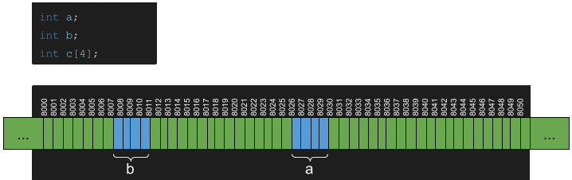
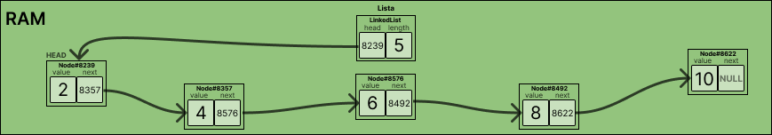
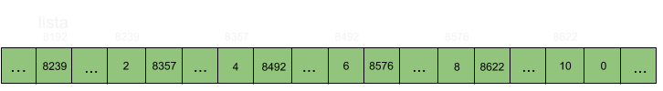
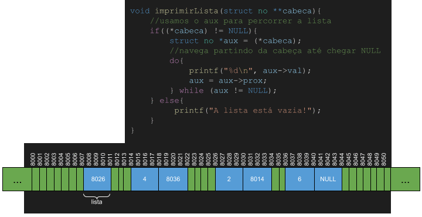
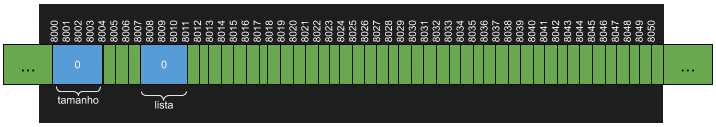
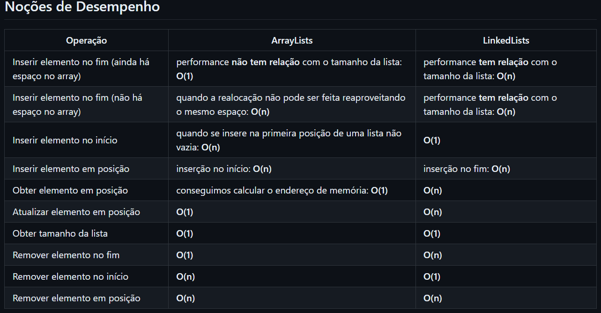

# Aula 4

### LinkedList

Otimizar a utilização de memoria e melhorar a estabiliade de espaço usado é uma forma de melhorar o desempenho de um software, assim sendo evitar gastos de memoria desnecessarios e espaços vazios é excessial.



Uma LinkedLists(ou listas ligadas, em pt-br) são listas implementaadas com nós, e cada nó possui um espaço de memória para armazenar o elemento e outro espaço de memoria para armazenar o ponteiro(endereço de memória) para o nó seguinte.



Uma outra forma de representar o armazenado de dados na forma de um vetor.



Um ponto positivo para as listas ligadas é o fato de que elas não possuem espaços ociosos. Porém para cada espaço novo alocado é necessario mais 4 bytes para alocar o ponteiro que aponta para o proximo nó. Com isso podemos concluir que dependendo da situação a LinkedList pode ser mais eficiente em temos de alocamento de memoria do que um ArrayList por consumir bem menos espaço.

1. Estrututa:
    1.1 Nós
    1.2 Ponteiros
-- A primeira necessaria a ser criada é a estrutura para um nó.

```C
struct no{
    int val;
    struct no *prox;
};
```
Os metodos devem ser implementados como extensões para que possa ser feito os testes unitarios nos mesmo.

**OBS:** Uma LinkedList pode iniciar o primeiro como sendo nulo, pois serem será usada uma função para alocar o novo ponteiro na memoria.

```C
struct linkedlist{
    struct no* cabeca;
    int tamanho  -- usado para medir o tamanho da lista
};
```
#### Função imprimir

Ao criar uma LinkedList precisamos criar uma variável para guardar o endereço do primeiro nó da lista. Estte elemento é chamado de cabeça, para imprir a lista, basta partir da cabeça e imprimir o valor de todos os nós, até que não haja mais nós, ou em outra palavras,até que o ponteiro para o próximo nó seja NULL.



```C
// Código usado para imprimir uma linked list
void imprimirLista(struct linkedlist* lista) {
    //usamos o aux para percorrer a lista
    if (lista->cabeca != NULL) {
        struct no* aux = lista->cabeca;
        //navega partindo da cabeça até chegar NULL
        printf("[");
        do {
            printf("%d", aux->val);
            aux = aux->prox;
            if (aux != NULL) {
                printf(", ");
            }
        } while (aux != NULL);
        printf("]");
    }
    else {
        printf("A lista está vazia!");
    }
}

```

#### Inserir elemento no fim da lista
Observações Importantes:
1. **A lista está Vazia**, nesse caos, basta apontar a cabeça da lista para o nó recém-criado.
2. **A lista não está vazia**, nesse caso, precisamos precorrer até o último elemento da lista e atualizar o valor de **prox**  desse último nó para o nó recem-criado.
**OBS:** É interessante criar uma variavel que possa armazenda sempre o final da lista.
```C
// Assinatura da função
void inserirElementoNoFim(struct linkedlist* lista, int valor)
```



#### Inserir elemento no ínici da lista
Observações importantes:
1. **A lista está Vazia**, Nesse caso, basta apontar a cabeça da lista para o nó recém-criado.
2. **A lista não está vazia**, nesse caso,  basta apontar o ponteiro prox do nó recém-criado para o endereço que a cabeça da lista aponta, pois o novo nó precisa apontar para a antiga cabeça da lista. Por fim, apontamos a cabeça da lista para o nó recém-criado.

```C
// Inserir no começo assinatura
void inserirElementoNoInicio(struct linkedlist* lista, int valor)

// Inserir na posição Espefica
void inserirElementoEmPosicao(struct linkedlist* lista, int valor, int posicao)

// Obter elemento da lista
int obterElementoEmPosicao(struct linkedlist* lista, int posicao)

// Remover da lista
void removerElementoEmPosicao(struct linkedlist* lista, int posicao)
```

