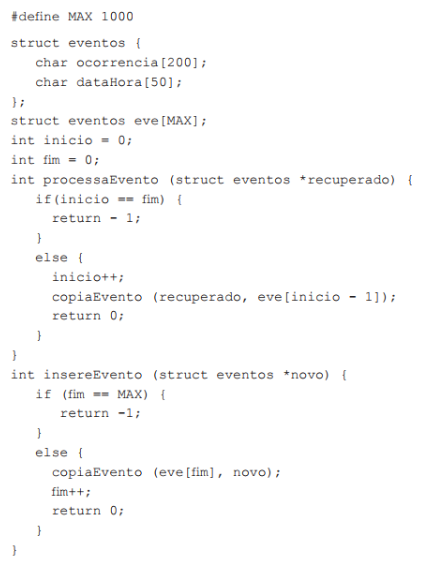
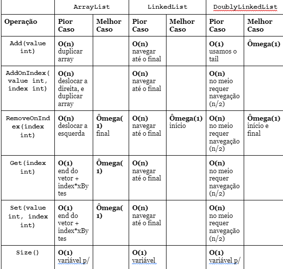

```
Disciplina: Algoritmos e Estruturas de Dados I (EDI)
Professor: Eduardo de Lucena Falcão
Exercício sobre Listas, Pilhas, Filas, Filas de Duas Pontas, e Algoritmos de Busca
```

## Gerais
1. Explique a diferença entre um TAD e uma ED. Exemplifique.

2. A biblioteca de coleções da linguagem Java disponibiliza implementações de propósito geral para estruturas de dados elementares, como listas, filas e pilhas. Considere as seguintes definições de classes que representam implementações de estruturas de dados disponíveis na biblioteca da linguagem:
* Classe A: os objetos são organizados em uma ordem linear e podem ser inseridos somente no início ou no final dessa sequência;
* Classe B: os objetos são organizados em uma ordem linear determinada por uma referência ao próximo objeto; 
* Classe C: os objetos são removidos na ordem oposta em que foram inseridos;
* Classe D: os objetos são inseridos e removidos respeitando a seguinte regra: o elemento a ser removido é sempre aquele que foi inserido primeiro.

Nesse contexto, assinale a alternativa que representa, respectivamente, as estruturas de dados implementadas pelas classes A, B, C e D.

* A) Lista circular, lista simplesmente ligada, pilha e fila
* B) Deque, lista simplesmente ligada, pilha e fila. 
* C) Lista duplamente ligada, lista simplesmente ligada, fila e pilha. 
* D) Pilha, fila, deque e lista simplesmente encadeada. 
* E) Deque, pilha, lista ligada e fila.


3. O coordenador geral de um comitê olímpico solicitou a implementação de um aplicativo que permita o registro dos recordes dos atletas à medida que forem sendo quebrados, mantendo a ordem cronológica dos acontecimentos, e possibilitando a leitura dos dados a partir dos mais recentes. Considerando os requisitos do aplicativo, a estrutura de dados mais adequada para a solução a ser implementada é:

* A) O deque: tipo especial de lista encadeada, que permite a inserção e a remoção em qualquer das duas extremidades da fila e que deve possuir um nó com a informação (recorde) e dois apontadores, respectivamente, para os nós próximo e anterior.
* B) A fila: tipo especial de lista encadeada, tal que o primeiro objeto a ser inserido na fila é o primeiro a ser lido; nesse mecanismo, conhecido como estrutura FIFO (First In- First Out), a inserção e a remoção são feitas em extremidades contrárias e a estrutura deve possuir um nó com a informação (recorde) e um apontador, respectivamente, para o próximo nó.
* C) A pilha: tipo especial de lista encadeada, na qual o último objeto a ser inserido na fila é o primeiro a ser lido; nesse mecanismo, conhecido como estrutura LIFO (Last In- First Out), a inserção e a remoção são feitas na mesma extremidade e a estrutura deve possuir um nó com a informação (recorde) e um apontador para o próximo nó.
* D) A fila invertida: tipo especial de lista encadeada, tal que o primeiro objeto a ser inserido na fila é o primeiro a ser lido; nesse mecanismo, conhecido como estrutura FIFO (First In- First Out), a inserção e a remoção são feitas em extremidades contrárias e a estrutura deve possuir um nó com a informação (recorde) e um apontador, respectivamente, para o nó anterior.
* E) A lista circular: tipo especial de lista encadeada, na qual o último elemento tem como próximo o primeiro elemento da lista, formando um ciclo, não havendo diferença entre primeiro e último, e a estrutura deve possuir um nó com a informação (recorde) e um apontador, respectivamente, para o próximo nó.


4. Estruturas de dados, tais como filas e pilhas, são utilizadas em diversas aplicações para automação industrial por meio de linguagens de programação textuais. O texto estruturado (ST) é uma das opções de linguagem de programação definidas pela norma IEC 61131-3. O trecho de código a seguir foi implementado nesse contexto.


É correto afirmar que a estrutura de dados e a funcionalidade desse código tratam-se de:
* A) uma fila que processa primeiro os eventos mais antigos.
* B) uma pilha que processa primeiro os eventos mais antigos.
* C) uma pilha que processa primeiro os eventos mais recentes.
* D) uma pilha que processa os eventos na ordem escolhida pelo operador.
* E) uma fila que processa os eventos de acordo com seu respectivo grau de prioridade.


### Listas
Na linguagem GoLang, use a interface IList definida abaixo e programe as seguintes estruturas de dados: ArrayList, LinkedList, DoublyLinkedList. (replit)

```GO
type IList interface {
	Add(value int)
	AddOnIndex(value int, index int) error
	RemoveOnIndex(index int) error
	Get(index int) (int, error)
	Set(value int, index int) error
	Size() int
}
```

Considere as EDs apresentadas na tabela a seguir e responda o desempenho de tempo de pior caso e melhor caso para cada operação listada. 





Cite uma vantagem e uma desvantagem do array list em relação à lista ligada.
Cite uma vantagem e uma desvantagem da lista duplamente ligada em relação à lista ligada.
Escreva uma função in-place para inverter a ordem de um ArrayList. 
func (list *ArrayList) Reverse()
type ArrayList struct {
	values   []int
	inserted int
}

Escreva uma função in-place para inverter a ordem de uma LinkedList. 
func (list *LinkedList) Reverse()
type LinkedList struct {
	head *Node
	size int
}
type Node struct {
	value int
	next  *Node
}

Escreva uma função in-place para inverter a ordem de uma DoublyLinkedList. 
func (list *DoublyLinkedList) Reverse()
type DoublyLinkedList struct {
	head *Node2P
	tail *Node2P
	size int
}
type Node2P struct {
	prev  *Node
	value int
	next  *Node
}

Por que não faz sentido adicionarmos uma cauda (tail) em LinkedLists?


Pilhas
Na linguagem GoLang, use a interface IStack definida abaixo e programe as seguintes estruturas de dados: ArrayStack, LinkedListStack. (replit)
type IStack interface {
	Push(value int)
	Pop() (int, error)
	Peek() (int, error)
	IsEmpty() bool
	Size() int
}

Considere as EDs apresentadas na tabela a seguir e responda o desempenho de tempo de pior caso e melhor caso para cada operação listada. 


ArrayStack
LinkedListStack
Operação
Pior Caso
Melhor Caso
Pior Caso
Melhor Caso
Push(value int)


O(n)
duplicar


O(1)
topo está na cabeça da lista


Pop() (int, error)


O(1)


O(1)
basta apontar a cabeça da lista p/ prox


Peek() (int, error)
O(1)


O(1)
topo está na cabeça da lista


IsEmpty() 


O(1)


O(1)


Size()


O(1)


O(1)


Escreva uma função que detecta se uma certa combinação de parênteses está balanceada. Dica 1: usar uma pilha. Dica 2: pensar nos casos de sucesso e casos de falha antes da implementação
func balparenteses(par string) bool

Uma pilha é uma estrutura de dados que armazena uma coleção de itens de dados relacionados e que garante o seguinte funcionamento: o último elemento a ser inserido é o primeiro a ser removido. É comum na literatura utilizar os nomes push e pop para as operações de inserção e remoção de um elemento em uma pilha respectivamente. O seguinte trecho de código em linguagem C define uma estrutura de dados pilha utilizando um vetor de inteiros, bem como algumas funções para sua manipulação.
#include <stdlib.h>
#include <stdio.h>
typedef struct {
   int elementos[100];
   int topo;
}pilha;
pilha * cria_pilha() {
   pilha * p =malloc(sizeof(pilha));
   p->topo = -1;
   return pilha;
}
void push(pilha *p, int elemento) {
   if (p->topo >= 99)
      return;
   p->elementos[++p->topo] = elemento;
}
int pop(pilha *p) {
   int a = p->elementos[p->topo];
   p->topo--;
   return a;
}

O programa a seguir utiliza uma pilha.
int main() {
    pilha * p = cria_pilha();
    push(p, 2);
    push(p, 3);
    push(p, 4);
    pop(p);
    push(p, 2);
    int a = pop(p) + pop(p);
    push(p, a);
    a += pop(p);
    printf("%d", a);
    return 0;
}

A esse respeito, avalie as afirmações a seguir.
A complexidade computacional de ambas funções push e pop é O(1).
O valor exibido pelo programa seria o mesmo caso a instrução a += pop(p); fosse trocada por a += a;
Em relação ao vazamento de memória (memory leak), é opcional chamar a função free(p), pois o vetor usado pela pilha é alocado estaticamente.
É correto o que se afirma em
I, apenas.
III, apenas.
I e II, apenas.
II e III apenas.
I, II e III.

Filas 
Mencione algumas aplicações de Filas.
Na linguagem GoLang, use a interface IQueue definida abaixo e programe as seguintes estruturas de dados: ArrayQueue, LinkedListQueue. (replit)
type IQueue interface {
	Enqueue(value int)
	Dequeue() (int, error)
	Front() (int, error)
	IsEmpty() bool
	Size() int
}

Considere as EDs apresentadas na tabela a seguir e responda o desempenho de tempo de pior caso e melhor caso para cada operação listada. 


ArrayQueue
LinkedListQueue
Operação
Pior Caso
Melhor Caso
Pior Caso
Melhor Caso
Enqueue(value int)


O(n)
aumentar o array


O(1)
uso o rear


Dequeue() (int, error)
O(1)


O(1)
uso o front


Front() (int, error)
O(1)


O(1)
uso o rear


IsEmpty() 


O(1)


O(1)


Size()


O(1)


O(1)


Escreva uma função que retorne a quantidade de elementos inseridos em uma Fila implementada com vetor. Escreva a função Size( ) considerando que o struct ArrayQueue não contém a variável size, como apresentado na tabela a seguir. Lembre-se que os índices de front e rear inicialmente assumem o valor -1, e que o ArrayQueue tem um caráter circular. 
func (queue *ArrayQueue) Size()
type ArrayQueue struct {
	values []int
	front  int
	rear   int
}


Filas de Duas Pontas (Deque)
Mencione algumas aplicações de Deques.
Na linguagem GoLang, use a interface IQueue definida abaixo e programe as seguintes estruturas de dados: ArrayQueue, LinkedListQueue. (replit)
type IDeque interface {
	EnqueueFront(value int)
	EnqueueRear(value int)
	DequeueFront() (int, error)
	DequeueRear() (int, error)
	Front() (int, error)
	Rear() (int, error)
	IsEmpty() bool
	Size() int
}

Considere as EDs apresentadas na tabela a seguir e responda o desempenho de tempo de pior caso e melhor caso para cada operação listada. 


ArrayDeque
DoublyLinkedListDeque
Operação
Pior Caso
Melhor Caso
Pior Caso
Melhor Caso
EnqueueFront(value int)


O(n)
duplicar array


O(1)


EnqueueRear(value int)


O(n)
duplicar array


O(1)


DequeueFront() (int, error)
O(n)
duplicar array


O(1)


DequeueRear() (int, error)
O(n)
duplicar array


O(1)


Front() (int, error)
O(1)


O(1)


Rear() (int, error)
O(1)


O(1)


IsEmpty() 


Size()


Algoritmos de Busca
Explique a diferença e aplicabilidade entre uma busca linear e uma busca binária.
Qual a complexidade de tempo da busca linear e da busca binária? Apresente um gráfico com as duas funções, sendo o eixo horizontal referente ao espaço de busca (tamanho do vetor), e o eixo vertical referente à complexidade de tempo.
Implemente um algoritmo de busca binária que opere em vetores ordenados de modo crescente.
// versao recursiva
func bin_search(val int, list []int, start int, end int) int
// ou versao iterativa
func bin_search(val int, list []int) int

Implemente um algoritmo de busca binária que opere em vetores ordenados de modo decrescente.
// versao recursiva
func rev_bin_search(val int, list []int, start int, end int) int
// ou versao iterativa
func rev_bin_search(val int, list []int) int

Suponha que você queira criar uma nova implementação do TAD List que sempre se mantém ordenada: OrderedList. Uma forma de fazer isso seria anulando a função que permite adicionar em uma posição arbitrária, AddOnIndex, e ajustar a implementação de Add(value int) para que ela sempre adicionasse value na posição correta da lista. Proveja a implementação das funções de OrderedList, apresentadas na tabela a seguir. 
type IList interface {
	Add(value int)
	AddOnIndex(value int, index int) error
	RemoveOnIndex(index int) error
	Get(index int) (int, error)
	Set(value int, index int) error
	Size() int
}
type OrderedList struct {
	//…
}

func (list *OrderedList) Add(val int) {}
func (list *OrderedList) AddOnIndex(value int, index int) error {}
func (list *OrderedList) RemoveOnIndex(index int) error {}
func (list *OrderedList) Get(index int) (int, error) {}
func (list *OrderedList) Set(value, index int) error {}
func (list *OrderedList) Size() int {}

Qual estratégia você usou para encontrar a posição correta a ser adicionada o novo valor? Justifique sua escolha.
Faz sentido executar algoritmos de busca sobre quaisquer implementação de listas? Justifique sua resposta.
A linguagem Python não permite alguns tipos de otimização como, por exemplo, a recursão em cauda e, devido à sua natureza dinâmica, é impossível realizar esse tipo de otimização em tempo de compilação tal como em linguagens funcionais como Haskell ou ML. 
Disponível em: http://www.python-history.blogspot.com/2009/04/origins-of-pythons-functional-features.html
Acesso: em 15 jun. 2019 (adaptado).
O trecho de código a seguir, escrito em Python, realiza a busca binária de um elemento x em uma lista lst e a função binary_search tem código recursivo em cauda.
1 def binary_search(x, lst, low=None, high=None): 
2     if low == None : low = 0 
3     if high == None : high = len(lst)-1 
4     mid = (high + low) // 2 
5     if low > high : 
6         return None 
7     elif lst[mid] == x : 
8         return mid 
9     elif lst[mid] > x : 
10        return binary_search(x, lst, low, mid-1) 
11    else : 
12        return binary_search(x, lst, mid+1, high)

Acesso em: 15 jun. 2019 (adaptado).


Considerando esse trecho de código, avalie as afirmações a seguir.
Substituindo-se o conteúdo da linha 10 por high = mid - 1 e substituindo-se o conteúdo da linha 12 por low = mid + 1, não se altera o resultado de uma busca.
Envolvendo-se o código das linhas 4 a 12 em um laço while True, substituindo-se o conteúdo da linha 10 por high = mid - 1 e substituindo-se o conteúdo da linha 12 por low = mid + 1 remove-se a recursão de cauda e o resultado da busca não é alterado.
Substituindo-se o código da linha 10 por: 
newhigh = mid-1 
return binary_search(x, lst, low, newhigh) 
e substituindo-se o código da linha 12 por: 
newlow = mid+1 
return binary_search(x, lst, newlow, high)
remove-se a recursão de cauda.
Substituindo-se o conteúdo das linhas 9 a 12 por:
if lst[mid] > x : 
newlow = low 
newhigh = mid-1 
else: 
newlow = mid+1 
newhigh = high 
return binary_search(x, lst, newlow, newhigh) 
mantém-se o resultado da busca. 


É correto o que se afirma em:
I, apenas. 
II e III, apenas. 
II e IV, apenas. 
I, III e IV, apenas. 
I, II, III e IV.
Observe o código abaixo escrito na linguagem C.
#include <stdio.h>
#define TAM 10
int funcaol(int vetor[], int v){
	int i;
	for (i = 0; i < TAM; i++){
	if (vetor[i] == v)
		return i;
	}
	return -1;
}
int funcao2(int vetor[], int v, int i, int f){
		int m = (i + f) / 2;
		if (v == vetor[m])
			return m;
		if (i >= f)
			return -1;
		if (v > vetor[m])
			return funcao2(vetor, v, m+l, f);
		else
		 	 return funcao2(vetor, v, i, m-1);
}
int main(){
		int vetor[TAM] = {1, 3, 5, 7, 9, 11, 13, 15, 17, 19};
 	printf(“%d - %d”, funcao1(vetor, 15), funcao2(vetor, 15, 0, TAM-1));
	 return 0;
}

A respeito das funções implementadas, avalie as afirmações a seguir.
O resultado da impressão na linha 24 é: 7 - 7.
A função funcao1, no pior caso, é uma estratégia mais rápida do que a funcao2.
A função funcao2 implementa uma estratégia iterativa na concepção do algoritmo.
É correto o que se afirma em:
I, apenas.
III, apenas.
I e II, apenas.
II e III, apenas.
I, II e III.


