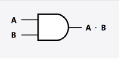
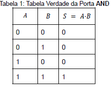
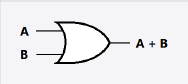
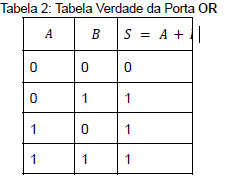

# Aula 2 CD - laboratorio 

### Portas Lógicas 
#### Introdução
Nas operações booleanas temos apenas dois estados distintos que são eles
    1. O estado 0 (Zero)
    2. O estado 1(um)
Comumente, atribui-se o estado 0 para representar as informações: 
1. Desligado
2. Falso
3. Chave aberta 
4. Ausência de tensão 

Já o estado 1 é o completo oposto:
1. Ligado
2. Chave fechada
3. presença de tensão
4. verdadeiro

As postas lógicas que operam esses estados são as portas ```AND(E)```, ```OR(OU)``` e ```NOT(não)```.


#### Portas Lógicas do tipo AND(E):



A função AND produz em sua sáida o valor 1, quando ambas as entradas são 1, no caso A = 1 e B = 1 para que a sáida seja também 1, logo s = A*B = 1 se somente (A e B) = 1, caso contrario s = 0. 
```
Chama-se de **Tabela da verdade** um mapa onde se representa todas as possibilidades das portas lógicas e seus respectivos resultados, na tabela da verdade podemos encontrar como uma porta funciona.

S = A*B que se lê, S é igual a A e B.

```


#### Porta lógica do tipo (OR/OU):



A função da porta lógica OR quando qualquer uma das duas entradas tem o valor 1, é ter uma saída com o valor 1, logo se (A = 0 e B = 1), (A = 1 e B = 0) e (A = 1 e B = 1) em todos esses casos a sáida será igual a 1. A unica forma da saída para esse tipo de entrada ser igual a 0 é se (A = 0 e B = 0). 



Para a tabela da verdade acima S = A + B que se lê, S é igual A ou B. 


