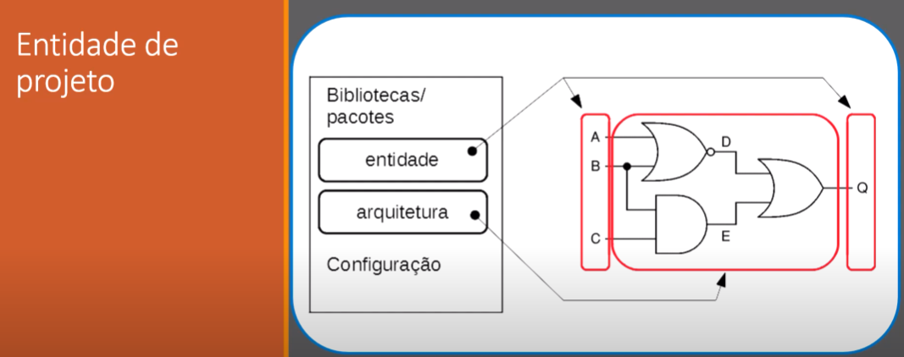
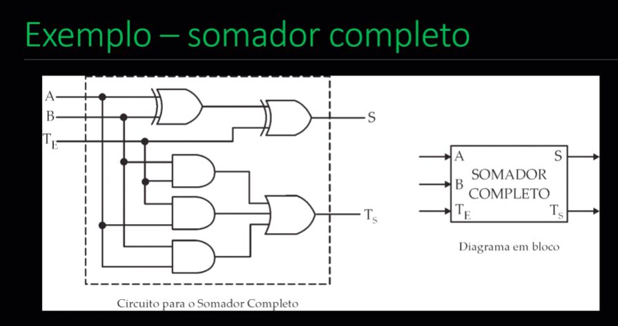

# Aula - Estrutura de código 



1. Na entidade são declarados os ports ou portas, que podem ser de entrada ou sáida.
2. Na arquitetura que o código será realmente utilizado de forma que possa ser usado lógica nos  codigos.

A entidade ```generic``` é uma entidade usada quando queremos usar um valor constante.

**OBS:** variaveis do tipo inout podem ser usadas como entrada e sáida.

**OBS:**  O tipo buffer de varieveis do tipo saída,que é um tipo que pode ser lido pelo código.
já a arquitetura pode ser usada da seguinte forma.

```VHDL
architecture nome_arc of entidade_exemplo is 
-- Declarações: sinais 
-- Constantes
-- Componentes
-- Subprogramas
-- Novos tipos 
-- Outros

begin 
-- Comandos concorrentes
end architecture nome_arc; -- main

```




```VHDL
--Exemplo Somador Completo
-- Autor: José Felix R. Anselmo
-- Data: 14/03/2024 

entity somador_completo is 
    port(
        A, B  :   in  bit; -- Entrada
        TE    :   in  bit; -- Transporte de Entrada
        S     :   out bit;  -- Saida
        TS    :   out bit   -- Transporte de saida
    );
end entity;

architecture main of somador_completo is 
begin  
    S <= A XOR B XOR TE;
    TS <= (A AND B) OR (A AND TE) OR (B AND TE)

end architecture;

```