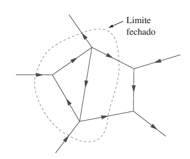

# Leis de kirchhoff 
São formalmente conhecidas por: 

1. Lei de kirchhoff das correntes(LKC, lei dos nós)
    * 1.1 Diz que a soma algébrica das correntes que entram em um nó é igual a soma das correntes que saem.
    **OBS:** Um nó pode ser considerado uma superficie fechada em um ponto.
    
2. Lei de kirchhoff das tensões(LKT, lei das malhas)
    *2.1 Diz que a soma algébrica de todas as tensões em torno de um caminho fechado (ou laço) é zero, logo  a soma das quedas de tensão é igual á soma das elevações de tensão.
    

    Percorrendo no sentido horario temos o seguinte:
    **- v1 + v2 + v3 - v4 + v5 => v2 + v3 + v5 = v1 + V4**
    Já no sentido anti-horario: 
    **+ v1 - v2 - v3 + v4 - v5 => v2 + v3 + v5 = v1 + v4**    
    **OBS:** Se as fontes estiverem em serie a soma das fontes resultará na fonte total. 
    **OBS:** Para impedir a violação da LKT, um circuito não pode conter duas tensões diferentes V1 e V2 em paralelo a menos que V1 = V2.
    

